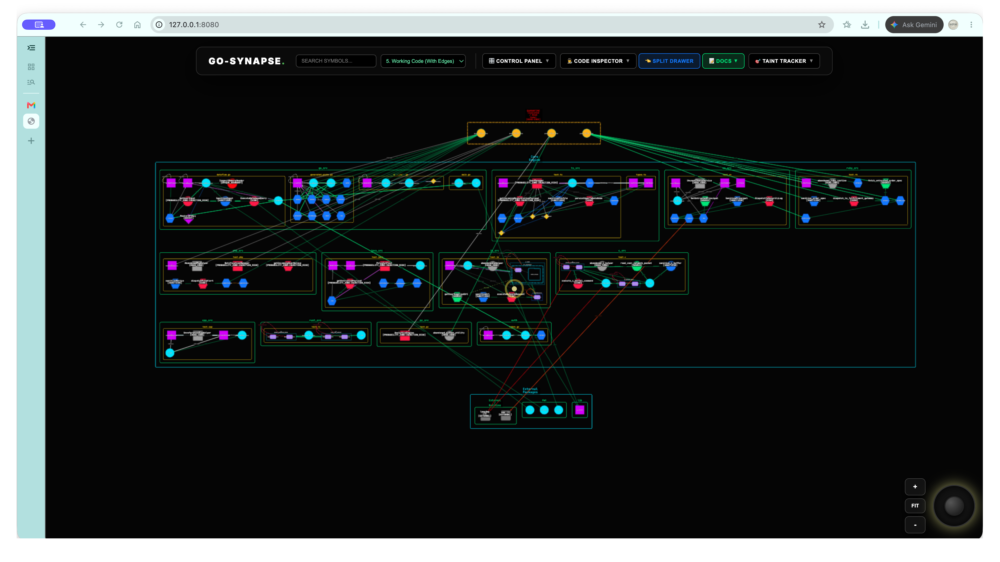

# Go-Synapse-Test-Repo

Official multi-language testbed repository for **[Go-Synapse](https://warmpondwater.com)** — the local-first, interactive 2D code intelligence, AST mapping, and security verification engine.




---

## Overview

This repository is designed for developers, architects, and security auditors to test, evaluate, and benchmark Go-Synapse across **11 core programming languages** with pre-configured patterns for:
* **Polyglot Call Graph Mapping**: Go, TypeScript, JavaScript, Python, Rust, C, C++, C#, Java, PHP, and Ruby.
* **Full Edge Typology Verification**: `calls`, `returns`, `reads`, `writes`, `instantiates`, `references`, `implements`, and `contains`.
* **Static Taint Tracing**: Complete, uninterrupted source-to-sink vulnerability paths (`SOURCE` $\rightarrow$ `SANITIZER` $\rightarrow$ `SINK`).
* **Dead-Code Quarantine**: 0 in-degree isolated functions automatically detected and quarantined.
* **Deterministic Cryptographic Hashing**: SHA-256 database graph digests (`CalculateDatabaseIntegrityHash()`) and RSA-2048 signed audit certificates (`audit_certificate.json`).
* **Dual Execution Modes**: Batch CLI / CI verification and interactive Model Context Protocol (MCP) AI Agent co-piloting.

---

## Language & Verification Matrix

All 11 languages are strictly indexed in [`test_manifest.json`](test_manifest.json):

| Directory | Language | Typology Patterns & Language Server | Taint Pipeline (`SOURCE` $\rightarrow$ `SANITIZER` $\rightarrow$ `SINK`) |
| :--- | :--- | :--- | :--- |
| [`go_src/`](go_src/) | **Go** | `TokenProcessor` interface, `SecurityPipeline` instantiation, `unsafe.Pointer` boundary, `gopls` | `GetUserInput` $\rightarrow$ `SanitizeInput` $\rightarrow$ `ExecuteDatabaseQuery` |
| [`ts_src/`](ts_src/) | **TypeScript** | `IUserManager` interface, `UserManager` class implementation, `new UserManager()`, `typescript-language-server` | `getIncomingRegistrationPayload` $\rightarrow$ `sanitizeProfile` $\rightarrow$ `persistUserToDatabase` |
| [`js_src/`](js_src/) | **JavaScript** | `NetworkClient` class, async calls, variable state mutations, `typescript-language-server` | `getUserSuppliedUrl` $\rightarrow$ `sanitizeUrl` $\rightarrow$ `executeNetworkRequest` |
| [`py_src/`](py_src/) | **Python** | `AnalyticsEngine` class, `__init__` state mutations, SQLite database calls, `pyright-langserver` | `fetch_untrusted_event` $\rightarrow$ `sanitize_event_payload` $\rightarrow$ `persist_analytics_event` |
| [`rust_src/`](rust_src/) | **Rust** | `IFileProcessor` trait, `DataPipeline` struct, `impl IFileProcessor for DataPipeline`, `rust-analyzer` | `fetch_untrusted_input` $\rightarrow$ `sanitize_input` $\rightarrow$ `dispatch_to_kernel_sink` |
| [`c_src/`](c_src/) | **C** | `BufferContext` struct, pointer mutations, `setjmp`/`longjmp`, memory writes, `clangd` | `read_user_network_packet` $\rightarrow$ `sanitize_c_buffer` $\rightarrow$ `execute_c_kernel_command` |
| [`cpp_src/`](cpp_src/) | **C++** | `IPaymentAuthorizer` pure virtual class, `PaymentService` inheritance, `std::make_unique`, `clangd` | `fetchIncomingPayload` $\rightarrow$ `sanitizePayload` $\rightarrow$ `executeDatabaseTransfer` |
| [`cs_src/`](cs_src/) | **C#** | `ISecurityAuditor` interface, `SecurityAuditor` implementation, list state mutations, `omnisharp` | `GetUntrustedPrincipal` $\rightarrow$ `SanitizePrincipal` $\rightarrow$ `DispatchToSecurityLog` |
| [`java_src/`](java_src/) | **Java** | `IDataProcessor` interface, `PolyglotTest implements IDataProcessor`, `processedCount` state, `jdtls` | `getUntrustedPayload` $\rightarrow$ `sanitizePayload` $\rightarrow$ `persistToDatabase` |
| [`php_src/`](php_src/) | **PHP** | `INotificationService` interface, `NotificationManager` implementation, property mutations, `intelephense` | `getIncomingUserNotice` $\rightarrow$ `sanitizeNotice` $\rightarrow$ `dispatchPushAlert` |
| [`ruby_src/`](ruby_src/) | **Ruby** | `OrderProcessor` class, `@order_count` instance variable mutations, method chains, `solargraph` | `fetch_untrusted_order_spec` $\rightarrow$ `sanitize_order_spec` $\rightarrow$ `dispatch_to_fulfillment_gateway` |

---

## How to Test with Go-Synapse

### 1. Automated CI & Hash Verification
Run the automated verification suite which parses the workspace, validates 100% node/edge reconciliation, and verifies the deterministic SHA-256 graph integrity hash against [`test_manifest.json`](test_manifest.json):
```bash
./run_verification.sh
```

Or run Go-Synapse in audit mode directly:
```bash
# Verify 100% AST integrity and sign local audit certificate
./Go-Synapse -audit=verify -dir .
```

### 2. Interactive AI Agent Mode (MCP)
Attach an AI Coding Agent (e.g. AntiGravity, Claude Code, Cursor) to Go-Synapse via stdio:
```bash
./Go-Synapse -dir . -mcp
```
The AI agent can then autonomously interrogate the repository using the 13 MCP primitives:
- `execute_sql(query)`: Query the AST database directly in sub-2ms.
- `verify_integrity()`: Reconcile nodes/edges and verify the SHA-256 hash programmatically.
- `validate_code()`: Query language servers for real-time diagnostics.
- `annotate_node(id, color, badge)`: Paint threat and quarantine tags onto the live 2D visual canvas.

### 3. Launch Standalone 2D Visualizer
```bash
# Start local visual intelligence server
./Go-Synapse -dir . -port 8080
```
Open `http://127.0.0.1:8080` to interact with the 2D spatial canvas.

### 4. Run Offline Software Composition Analysis (SCA)
```bash
# Scan dependency manifests without sending network packets
./Go-Synapse -audit=sca -offline -dir .
```

---

## Test Manifest & Verification Schema

The test specification in [`test_manifest.json`](test_manifest.json) enforces:
* **Deterministic Digest**: `SHA-256(canonical_nodes_asc + canonical_edges_asc)` matching `fb49961c1056b737966939ac05a6216cc66e8245ae5314b46d51dd317cc015c2`.
* **100% Reconciliation**: Zero node coordinate mismatches and zero edge exclusions.
* **Taint Continuity**: Complete dataflow reachability across all 11 languages.
* **Dead Code Isolation**: Zero in-degree quarantine verification.

---

## License

This test repository is provided free and open for public evaluation under the [MIT License](LICENSE).
For Go-Synapse visualizer licensing and documentation, visit **[warmpondwater.com](https://warmpondwater.com)**.


